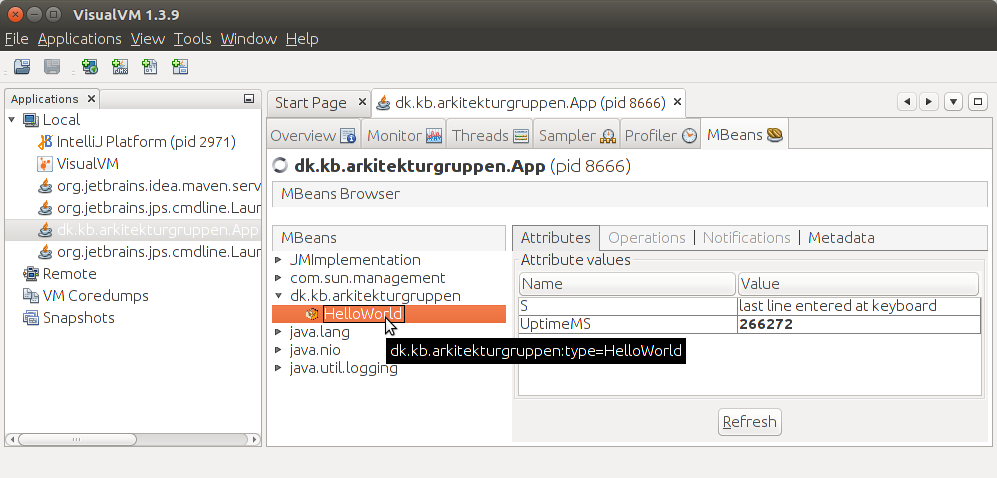

# jmx-hello-world

To run:
---

* Invoke App.  It registers a bean and waits for input from the command line.
* Start JConsole or VisualVM (in the Oracle JDK, enable JConsole-MBeans plugin), attach to "App" 
  and locate the MBean group "dk.kb.arkitekturgruppen" and click
  "Hello World".  The current values of the "updateMS" and "s" fields are shown.
* Type one or more lines of text as input to the running App.  Each time "Enter" is pressed a line showing the current number of
  milliseconds since program start and the line just typed is shown.
* Refresh the "HelloWorld" fields in JConsole/VisualVM and see that the value of "s" is the last line entered.

Background:
---

JMX is a very useful technology for interacting with 
a Java program in a separate way from what is explicitly coded by 
the programer.

In this project it is demonstrated how a very small and simple
subset of JMX can be used very easily to provide a "while running"-statistics
as an alternative to watching logfiles scroll endlessly or having to
explicitly code some kind GUI for the purpose.

The subset used here is:

* @MXBean annotates the interface to make it a MXBean.
* Only getters are exposed to make a read-only presentation of data.
* VisualVM/JConsole are used as clients to make configuration as simple as possible.

/tra 2017-05-24
